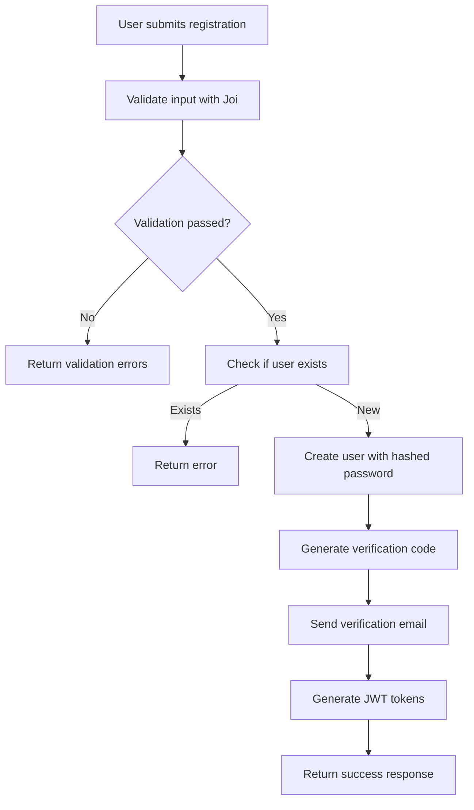
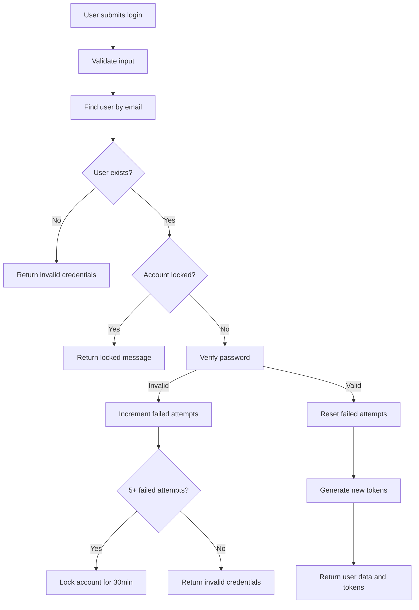
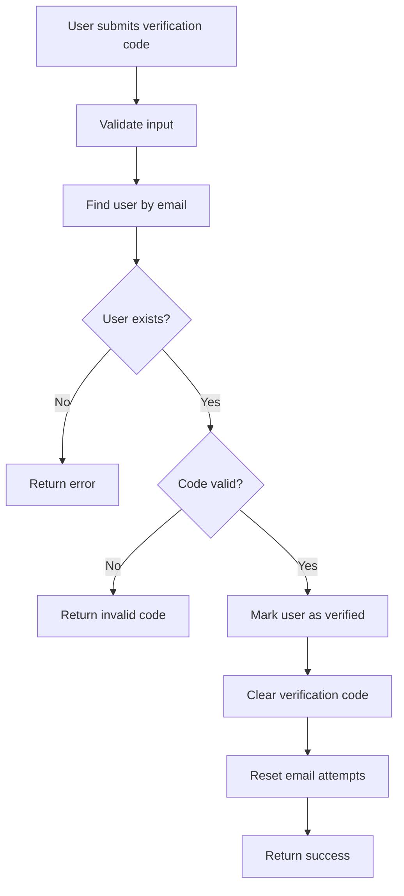
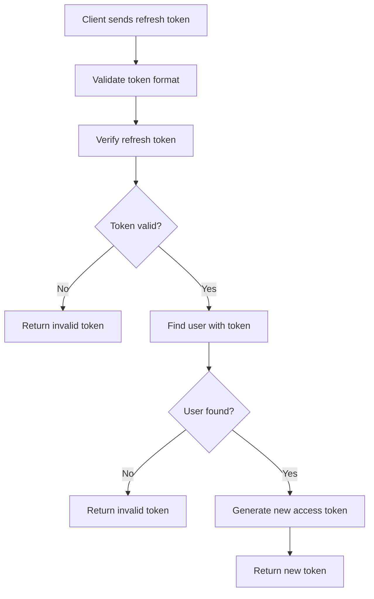

# DevCourse Authentication Flow Documentation

## 🔐 Overview

The DevCourse authentication system provides a comprehensive, secure, and user-friendly authentication experience with **email-only verification**:

- **User Registration** with email verification
- **Secure Login** with account locking protection
- **JWT-based Authentication** with access and refresh tokens
- **Password Reset** functionality via email
- **Profile Management**
- **Role-based Access Control** (Mentor/Learner)

## 📁 File Structure

```
server/src/
├── models/
│   └── User.js                    # User model with methods
├── controllers/auth/
│   ├── register.js               # User registration
│   ├── login.js                  # User login
│   ├── verifyEmail.js            # Email verification
│   ├── resendVerificationCode.js # Resend verification (email only)
│   ├── requestPasswordReset.js   # Password reset request (email only)
│   ├── verifyResetCode.js        # Verify reset code
│   ├── resetPassword.js          # Reset password
│   ├── refreshToken.js           # Token refresh
│   ├── logout.js                 # User logout
│   ├── getProfile.js             # Get user profile
│   ├── updateProfile.js          # Update profile
│   └── changePassword.js         # Change password
├── routes/
│   └── auth.js                   # Auth routes with validation
├── middleware/
│   ├── auth.js                   # Authentication middleware
│   └── validation.js             # Request validation
├── lib/
│   ├── utils/helper/
│   │   ├── generateToken.js      # JWT token generation
│   │   ├── password.js           # Password utilities
│   │   ├── sendEmail.js          # Email sending
│   │   ├── emailService.js       # Email service functions
│   │   └── response.js           # Custom response utility
│   ├── utils/mailsHtml/
│   │   ├── verificationEmail.js  # Email templates
│   │   └── passwordResetEmail.js
│   └── validations/auth/
│       ├── registerSchema.js     # Validation schemas (email only)
│       ├── loginSchema.js
│       ├── verifyEmail.js
│       ├── resendVerificationSchema.js
│       ├── requestPasswordResetSchema.js
│       ├── verifyResetCodeSchema.js
│       ├── resetPasswordSchema.js
│       └── index.js
```

## 🔄 Authentication Flow

### 1. User Registration Flow



**Steps:**
1. **Input Validation**: Uses `registerSchema` to validate name, email, password, role, etc.
2. **User Creation**: Creates new user with hashed password (bcrypt with salt rounds 12)
3. **Email Verification**: Generates 6-digit code and sends verification email
4. **Token Generation**: Creates access token (15m) and refresh token (7d)
5. **Response**: Returns user data and tokens

### 2. User Login Flow



**Security Features:**
- **Account Locking**: After 5 failed attempts, account is locked for 30 minutes
- **Password Verification**: Uses bcrypt comparison
- **Token Management**: Generates new access and refresh tokens
- **Last Login Tracking**: Updates user's last login timestamp

### 3. Email Verification Flow



**Rate Limiting:**
- Maximum 5 verification email attempts
- 2-minute cooldown between requests
- Automatic attempt reset after successful verification

### 4. Password Reset Flow (Email Only)

```mermaid
graph TD
    A[User requests password reset] --> B[Validate email]
    B --> C[Find user by email]
    C --> D{User exists?}
    D -->|No| E[Return success (security)]
    D -->|Yes| F[Generate reset code]
    F --> G[Send reset email]
    G --> H[Return success]
    I[User submits reset code] --> J[Validate code]
    J --> K[User submits new password]
    K --> L[Update password]
    L --> M[Clear reset code]
    M --> N[Return success]
```

### 5. Token Refresh Flow



## 🔧 Helper Functions

### Token Generation (`generateToken.js`)

```javascript
// Generate access token
const accessToken = generateToken(userId, '15m');

// Generate refresh token
const refreshToken = generateRefreshToken(userId);

// Verify tokens
const result = verifyToken(token);
const refreshResult = verifyRefreshToken(refreshToken);
```

### Password Utilities (`password.js`)

```javascript
// Hash password
const hashedPassword = await hashPassword(password);

// Verify password
const isValid = await verifyPassword(password, hashedPassword);
```

### Email Service (`emailService.js`)

```javascript
// Send verification email
await sendVerificationEmail(email, code, name);

// Send password reset email
await sendPasswordResetEmail(email, code, name);

// Send welcome email
await sendWelcomeEmail(email, name);
```

### Custom Response Utility (`response.js`)

```javascript
// Success responses
successResponse(res, 200, 'Success', data);
createdResponse(res, 'User created', userData);
updatedResponse(res, 'Profile updated', userData);

// Error responses
errorResponse(res, 400, 'Bad request', errors);
authErrorResponse(res, 'Invalid credentials');
validationErrorResponse(res, validationErrors);
```

## 🛡️ Security Features

### 1. Password Security
- **Hashing**: bcrypt with 12 salt rounds
- **Validation**: Minimum 8 characters with complexity requirements
- **Comparison**: Secure timing-safe comparison

### 2. Token Security
- **Access Tokens**: 15-minute expiration
- **Refresh Tokens**: 7-day expiration with database storage
- **Token Rotation**: New refresh tokens on login
- **Secure Storage**: Tokens stored in user document

### 3. Account Protection
- **Rate Limiting**: Email verification attempts limited
- **Account Locking**: Temporary lock after failed login attempts
- **Input Validation**: Comprehensive Joi validation schemas
- **SQL Injection Protection**: Mongoose ODM protection

### 4. Email Security
- **Verification Required**: Users must verify email before full access
- **Rate Limiting**: Prevents email spam (5 attempts, 2-minute cooldown)
- **Secure Codes**: 6-digit numeric codes with 10-minute expiration

## 📋 API Endpoints

### Public Endpoints

| Method | Endpoint | Description | Validation |
|--------|----------|-------------|------------|
| POST | `/api/auth/register` | User registration | `registerSchema` |
| POST | `/api/auth/login` | User login | `loginSchema` |
| POST | `/api/auth/verify-email` | Email verification | `verifyEmailSchema` |
| POST | `/api/auth/resend-verification` | Resend verification | `resendVerificationSchema` |
| POST | `/api/auth/request-password-reset` | Request password reset | `requestPasswordResetSchema` |
| POST | `/api/auth/verify-reset-code` | Verify reset code | `verifyResetCodeSchema` |
| POST | `/api/auth/reset-password` | Reset password | `resetPasswordSchema` |
| POST | `/api/auth/refresh-token` | Refresh access token | None |

### Protected Endpoints

| Method | Endpoint | Description | Middleware |
|--------|----------|-------------|------------|
| POST | `/api/auth/logout` | User logout | `authenticate` |
| GET | `/api/auth/profile` | Get user profile | `authenticate` |
| PUT | `/api/auth/profile` | Update profile | `authenticate` |
| PUT | `/api/auth/change-password` | Change password | `authenticate` |
| GET | `/api/auth/verify` | Verify token | `authenticate` |

## 🔍 Validation Schemas

### Registration Schema (Email Only)
```javascript
{
  name: string (2-100 chars, required),
  email: string (valid email, required),
  password: string (8+ chars, complexity required),
  role: 'mentor' | 'learner' (default: 'learner'),
  bio: string (max 500 chars, optional),
  skills: array of strings (max 10, optional),
  socialLinks: object (optional)
}
```

### Login Schema
```javascript
{
  email: string (valid email, required),
  password: string (required)
}
```

### Resend Verification Schema (Email Only)
```javascript
{
  email: string (valid email, required)
}
```

### Password Reset Schema (Email Only)
```javascript
{
  email: string (valid email, required)
}
```

## 🚀 Usage Examples

### Registration Request
```javascript
POST /api/auth/register
{
  "name": "John Doe",
  "email": "john@example.com",
  "password": "SecurePass123!",
  "role": "learner",
  "bio": "Full-stack developer",
  "skills": ["JavaScript", "React", "Node.js"]
}
```

### Login Request
```javascript
POST /api/auth/login
{
  "email": "john@example.com",
  "password": "SecurePass123!"
}
```

### Email Verification Request
```javascript
POST /api/auth/verify-email
{
  "email": "john@example.com",
  "verificationCode": "123456"
}
```

### Resend Verification Request
```javascript
POST /api/auth/resend-verification
{
  "email": "john@example.com"
}
```

### Password Reset Request
```javascript
POST /api/auth/request-password-reset
{
  "email": "john@example.com"
}
```

### Token Refresh Request
```javascript
POST /api/auth/refresh-token
{
  "refreshToken": "eyJhbGciOiJIUzI1NiIsInR5cCI6IkpXVCJ9..."
}
```

## 🔧 Environment Variables

```env
# JWT Configuration
JWT_SECRET=your_jwt_secret_key_here
JWT_REFRESH_SECRET=your_jwt_refresh_secret_key_here

# Email Configuration
EMAIL_HOST=smtp.gmail.com
EMAIL_PORT=587
EMAIL_USER=your_email@gmail.com
EMAIL_PASS=your_email_password_here

# Security Configuration
BCRYPT_SALT_ROUNDS=12
```

## 🐛 Error Handling

The auth system provides comprehensive error handling:

- **Validation Errors**: Detailed field-specific error messages
- **Authentication Errors**: Clear token and credential error messages
- **Rate Limiting**: User-friendly cooldown messages
- **Account Locking**: Clear lock duration information
- **Email Errors**: Graceful handling of email service failures

## 🔄 Database Schema

### User Model Fields
- **Basic Info**: name, email, password, role
- **Profile**: bio, skills, socialLinks, avatar, profilePicture
- **Security**: isVerified, verificationCode, failedLoginAttempts, isLocked
- **Tokens**: refreshTokens array with expiration
- **Timestamps**: createdAt, updatedAt, lastLogin

## 📈 Performance Considerations

- **Indexed Fields**: email, verificationCode, resetCode
- **Token Cleanup**: Expired refresh tokens are filtered out
- **Efficient Queries**: Optimized database queries with proper indexing
- **Caching**: Consider Redis for token storage in production

## 🚫 Removed Features

The following SMS-related features have been removed:
- ❌ SMS verification codes
- ❌ Phone number fields in registration
- ❌ SMS method in password reset
- ❌ SMS method in verification resend
- ❌ Phone number validation schemas

## ✅ Email-Only Benefits

- **Simplified UX**: Single verification method
- **Reduced Complexity**: No SMS service dependencies
- **Cost Effective**: No SMS charges
- **Reliable**: Email delivery is more reliable
- **Secure**: Email verification is industry standard

---

**DevCourse Authentication System** - Secure, scalable, and email-focused! 🔐📧 